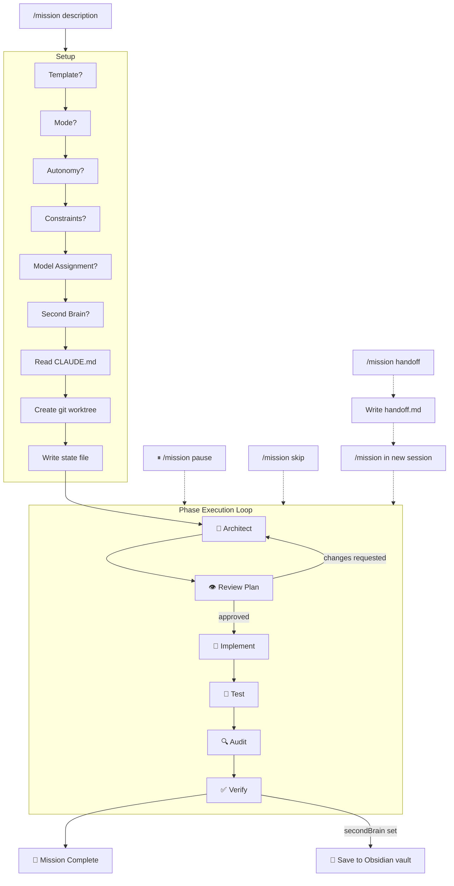
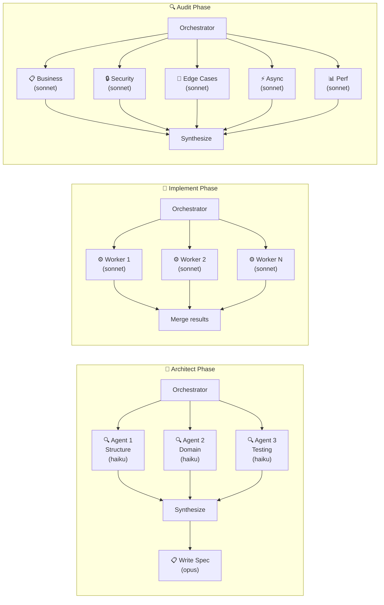
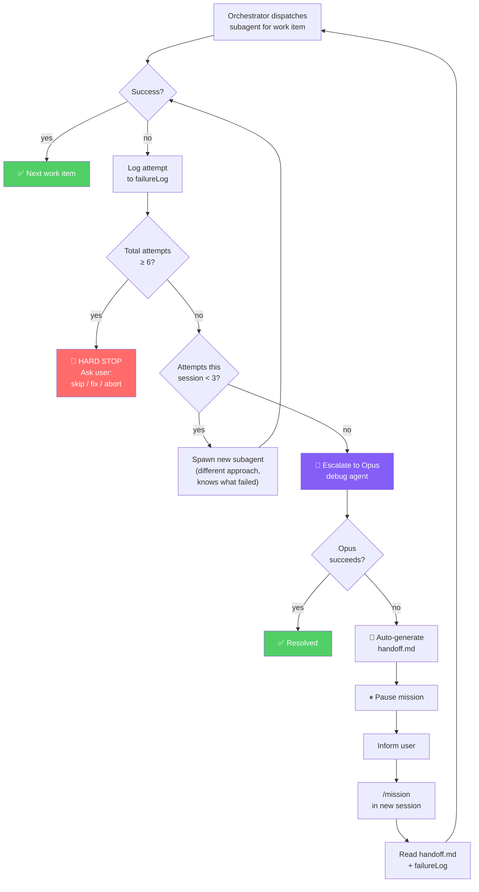
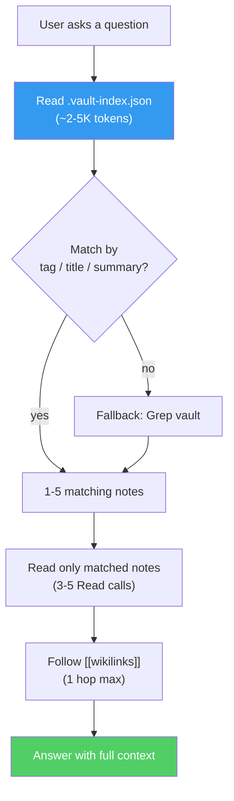
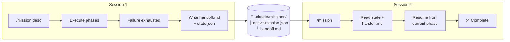

# claude-missions

A skill bundle for [Claude Code](https://claude.ai/code) — multi-phase mission orchestration + Obsidian second brain integration. Inspired by [pi-missions](https://github.com/itisbryan/pi-missions).

**Two skills, one repo:**
- **`/mission`** — structured development workflows with parallel subagents, failure escalation, and auto-handoff
- **`/obsidian`** — read, write, search, and link notes in your Obsidian vault with indexed lookup

## Install

```bash
# Install both skills
npx skills add itisbryan/claude-missions

# Or install one at a time
npx skills add itisbryan/claude-missions@mission
npx skills add itisbryan/claude-missions@obsidian
```

---

## Workflows

### 1. Full mission with vault documentation

The most powerful workflow — run a structured mission and save everything to your second brain.

```bash
# First time: set up your vault
/obsidian config
# → provide your Obsidian vault path (e.g., ~/Documents/niin2brain)

# Build the vault index so Claude can learn from your existing notes
/obsidian index

# Start a mission — select a template, set vault as second brain
/mission build a discount engine for the checkout service
# → Template: Feature
# → Second Brain: ~/Documents/niin2brain
# → Model Assignment: defaults

# Claude runs through all 6 phases automatically:
# 📐 Architect → reads your vault first for prior decisions and patterns
# 👁️ Review → you approve the plan
# 🔨 Implement → parallel workers build it
# 🧪 Test → writes and runs tests
# 🔍 Audit → 5 specialist reviewers check everything
# ✅ Verify → validates against the spec

# Every phase saves outputs to your vault:
# vault/missions/build-discount-engine/01-discovery.md
# vault/missions/build-discount-engine/02-plan.md
# vault/missions/build-discount-engine/decisions/decision-001.md
# ...etc
```

### 2. Quick bug fix

Minimal mode with regression-test-first discipline.

```bash
/mission fix the race condition in payment processing
# → Template: Bug Fix (auto-sets Minimal mode, Low autonomy)

# 3 phases:
# 📋 Plan → reproduce bug, find root cause, propose fix
# 🔨 Build → write failing test first, then fix, confirm test passes
# ✅ Verify → full test suite + linter
```

### 3. Research spike with vault output

Explore a question and save findings — no production code.

```bash
/mission evaluate whether we should migrate from Redis to Valkey
# → Template: Investigation (Minimal mode, High autonomy)
# → Second Brain: ~/Documents/niin2brain

# Claude explores, writes throwaway code to test hypotheses,
# then saves a structured report to your vault as a Resource note
```

### 4. Vault-powered development (no mission)

Use `/obsidian` standalone to leverage your second brain during regular coding.

```bash
# Before writing code, check what you already know
/obsidian search "authentication"
# → Claude reads the index, finds 3 relevant notes, shows summaries

# Read a specific note for context
/obsidian read decision-auth-strategy
# → Shows the full ADR with context, options, and decision

# Save what you learned during a coding session
/obsidian write pattern-retry-with-backoff
# → Creates an Area note in 02 - Areas/ with proper frontmatter and tags

# Document a key decision
/obsidian write decision-use-redis-for-sessions
# → Creates an ADR in decisions/ with options, trade-offs, consequences

# End of day — capture session context
/obsidian daily
# → Appends a summary to today's daily note (06 - Daily/2026-04-05.md)

# Check vault health periodically
/obsidian audit
# → Reports broken links, orphan notes, stale in-progress items
```

### 5. Cross-session handoff

When a mission gets complex or you need to continue tomorrow.

```bash
# Session 1: start a big mission
/mission refactor the entire payment module
# → Works through Architect, Review, starts Implement...
# → A work item fails 3 times, Opus debug also fails
# → Orchestrator auto-generates handoff.md, pauses mission

# Session 2 (next day): pick up where you left off
/mission
# → Reads state + handoff.md automatically
# → Shows: "Mission paused. Work item 'extract payment gateway' failed 4 times."
# → You decide: skip it, fix manually, or let Claude retry with fresh context
```

### 6. Track TODOs across code and vault

Keep work items in sync between your codebase and your second brain.

```bash
# See all open items — vault checkboxes + code TODOs in one view
/obsidian todo
# → Vault: 12 open items across 4 notes
# → Codebase: 5 TODOs, 2 FIXMEs
# → Priority: 2 FIXMEs should be addressed first

# Scan code and save TODO/FIXME/HACK comments to your vault
/obsidian todo scan
# → Writes 01 - Projects/<project>/code-todos.md
# → Grouped by type: FIXME (fix first) → TODO → HACK
# → Each item is a checkbox you can track in Obsidian

# Add a quick todo
/obsidian todo add "review the caching strategy before launch"
# → Adds to the current project note as a checkbox

# After a mission — implementation phase auto-scans for leftover TODOs
/mission build a notification system
# → During Implement phase, after all work items:
# →   "Found 3 TODOs and 1 FIXME in changed files"
# →   Auto-saved to vault if secondBrain is set
```

### 7. Index your vault for Claude to learn from

Turn your existing Obsidian vault into a knowledge base that Claude can query efficiently.

```bash
# Build the index (do this once, then periodically)
/obsidian index
# → Scans 73 notes in ~/Documents/niin2brain
# → Builds .vault-index.json (tags, summaries, links)
# → Generates _vault-map.md MOC in 00 - Maps of content/

# Now Claude can answer questions from your vault
"What patterns do we use for error handling?"
# → Claude reads index (1 call), finds 3 matching notes (3 calls)
# → Total: 4 reads instead of 73

"How did we decide on the discount engine architecture?"
# → Index lookup: tagIndex["project/nanoco"] ∩ tagIndex["architecture"]
# → Finds: Executive Summary, Design Systems, Refactoring Plan
# → Reads those 3 notes, follows [[links]] to Performance Projection
# → Gives you a complete answer from YOUR prior research
```

---

## /mission — Commands

| Command | Description |
|---|---|
| `/mission <description>` | Start a new mission |
| `/mission status` | Current phase and progress |
| `/mission log` | Full timeline with per-phase durations |
| `/mission skip` | Skip the current phase |
| `/mission pause` | Pause the mission |
| `/mission resume` | Resume a paused mission |
| `/mission handoff` | Generate handoff doc and pause for session transfer |
| `/mission done` | Mark mission complete early |
| `/mission reset` | Clear all mission state |

## /obsidian — Commands

| Command | Description |
|---|---|
| `/obsidian` | Show vault summary (note count, recent notes) |
| `/obsidian config` | Set vault path |
| `/obsidian index` | Build/rebuild vault index for fast lookup |
| `/obsidian write <title>` | Create or update a note with the right template |
| `/obsidian read <query>` | Find and display a note |
| `/obsidian search <query>` | Search vault content with context |
| `/obsidian todo` | Show all open items across vault + code |
| `/obsidian todo scan` | Scan codebase for TODO/FIXME, save to vault |
| `/obsidian todo add <item>` | Add a todo to the current project note |
| `/obsidian daily` | Append to today's daily note |
| `/obsidian link <from> <to>` | Add a wikilink between two notes |
| `/obsidian audit` | Check for broken links, orphans, stale notes |

---

## Modes

### Standard (6 phases)

| # | Phase | What happens |
|---|---|---|
| 1 | 📐 Architect | 3 parallel Explore agents analyze the codebase, then synthesize a spec |
| 2 | 👁️ Review Plan | Present the spec, wait for explicit approval |
| 3 | 🔨 Implement | Execute plan with parallel subagents |
| 4 | 🧪 Test | Unit, integration, edge cases, error paths |
| 5 | 🔍 Audit | 5 parallel reviewers merge and deduplicate findings |
| 6 | ✅ Verify | Assertion-based validation, full test suite + linter |

### Minimal (3 phases)

| # | Phase | What happens |
|---|---|---|
| 1 | 📋 Plan | Analyze codebase, outline approach, wait for approval |
| 2 | 🔨 Build | Implement + test combined |
| 3 | ✅ Verify | Run test suite, linter, validate against assertions |

## Templates

| Template | Mode | Autonomy | What it does |
|---|---|---|---|
| **Feature** | Standard | Medium | Full rigor. Backward compatibility + auth checks. |
| **Bug Fix** | Minimal | Low | Regression-test-first. Minimal change only. |
| **Refactor** | Standard | Medium | Behavior-preserving. Characterization tests first. |
| **Investigation** | Minimal | High | Output is a report, not code. |
| **Custom** | Choose | Choose | No template constraints. |

## Model Assignment

| Role | Default | Used in |
|---|---|---|
| Explorer | `haiku` | Architect: 3 parallel discovery agents |
| Planner | `opus` | Architect: spec writing |
| Worker | `sonnet` | Implement/Build: parallel code subagents |
| Business Reviewer | `sonnet` | Audit: spec alignment, business logic |
| Security Reviewer | `sonnet` | Audit: injection, auth, secrets |
| Edge Case Reviewer | `sonnet` | Audit: boundaries, nulls, partial failures |
| Reviewer | `sonnet` | Audit: async/concurrency + performance |
| Verifier | `sonnet` | Verify: test + lint validation |

## Autonomy Levels

| Level | Behavior |
|---|---|
| **Low** | Pause after every phase. Wait for "continue". |
| **Medium** | Pause at phase boundaries. Continue through routine work. |
| **High** | Run to completion. Stop only on critical failures. |

All levels force-pause when failure escalation exhausts retries (3 attempts + Opus + handoff).

---

## Architecture

### Mission Lifecycle



### Parallel Subagents



### Failure Escalation & Auto-Handoff



### Vault Index Lookup



### State & Session Continuity



---

## Obsidian Integration

### Note Types & PARA Structure

| Type | Folder | When to use |
|---|---|---|
| **Project** | `01 - Projects/` | Active work with deadlines |
| **Area** | `02 - Areas/` | Domain knowledge, ongoing responsibilities |
| **Resource** | `03 - Resources/` | External references, tools, guides |
| **Decision** | `decisions/` | Architecture/design trade-offs (ADR format) |
| **Daily** | `06 - Daily/` | Journal entry, session log |
| **Fleeting** | `05 - Fleeting/` | Quick unprocessed thought |

### Mission Phase Outputs

When `secondBrain` is set, each phase auto-saves to the vault:

```
vault/missions/<mission-slug>/
├── _index.md               # MOC linking all phase notes
├── 01-discovery.md          # Codebase analysis findings
├── 02-plan.md               # Approved spec
├── 03-review-notes.md       # Review decisions
├── 04-implementation-log.md # Appended per work item
├── 05-test-report.md        # Test results + coverage
├── 06-audit-report.md       # Findings by severity
├── 07-verification-report.md # Final verdict
└── decisions/               # Trade-off ADRs
```

### Vault Index

`.vault-index.json` gives Claude a compact lookup table:

```json
{
  "noteCount": 73,
  "notes": {
    "path/to/note.md": {
      "title": "Note Title",
      "tags": ["backend", "architecture"],
      "aliases": ["alt name"],
      "links": ["Other Note", "Another Note"],
      "summary": "One-line description of this note.",
      "updated": "2026-04-05"
    }
  },
  "tagIndex": { "backend": ["path1.md", "path2.md"] },
  "linkGraph": { "note.md": ["linked-note.md"] },
  "folderIndex": { "Projects": ["path1.md"], "Areas": ["path2.md"] }
}
```

**Index first, read second.** Claude loads the index (~2-5K tokens), finds relevant notes, reads only those. For a 73-note vault, typical lookup: 5 Read calls instead of 73.

---

## Project Structure

```
claude-missions/
├── README.md
└── skills/
    ├── mission/                          # /mission skill
    │   ├── SKILL.md
    │   └── references/
    │       ├── protocol-planning.md
    │       ├── protocol-review.md
    │       ├── protocol-implementation.md
    │       ├── protocol-minimal-build.md
    │       ├── protocol-testing.md
    │       ├── protocol-audit.md
    │       ├── protocol-verification.md
    │       ├── protocol-phase-transition.md
    │       ├── protocol-handoff.md
    │       ├── protocol-second-brain.md
    │       ├── templates.md
    │       └── autonomy-levels.md
    └── obsidian/                         # /obsidian skill
        ├── SKILL.md
        └── references/
            ├── conventions.md
            └── templates/
                ├── project-note.md
                ├── area-note.md
                ├── resource-note.md
                ├── decision-adr.md
                └── daily-note.md
```

## License

MIT
