# claude-missions

[](https://claude.ai/code)
[](https://openai.com/codex)
[](https://ampcode.com)
[](https://opencode.ai)
[](LICENSE)



A skill bundle for [Claude Code](https://claude.ai/code) — multi-phase mission orchestration, plus a standalone Obsidian second-brain skill.

Inspired by [Factory.ai](https://factory.ai)'s Droid system and [pi-missions](https://github.com/itisbryan/pi-missions). See [Inspiration](docs/inspiration.md) for details.

**Three skills, one repo:**
- **`/mission`** — structured development workflows with parallel subagents, failure escalation, and auto-handoff. Token-aware: Haiku 4.5 scouting, scope-gated reviewers, and deterministic script offload (~15–30K saved per standard mission)
- **`/git-worktree`** — create isolated worktrees with auto-detected dependency install; auto-invoked by `/mission`
- **`/obsidian`** — read, write, search, and link notes in your Obsidian vault with indexed lookup

## Install

```bash
# Install all three skills
npx skills add itisbryan/claude-missions

# Or install one at a time
npx skills add itisbryan/claude-missions@mission
npx skills add itisbryan/claude-missions@obsidian
npx skills add itisbryan/claude-missions@git-worktree
```

## Quick Start

```bash
# Run a mission
/mission build a REST API for user management

# /obsidian is standalone (not coupled to missions) — use it whenever you like
/obsidian config
/obsidian index
/obsidian search "auth patterns"
```

## Commands

### /mission

| Command | Description |
|---|---|
| `/mission <description>` | Start a new mission |
| `/mission status` | Current phase and progress |
| `/mission log` | Full timeline with per-phase durations |
| `/mission skip` | Skip the current phase |
| `/mission pause` | Pause the mission |
| `/mission resume` | Resume a paused mission |
| `/mission handoff` | Generate handoff doc for session transfer |
| `/mission done` | Mark mission complete early |
| `/mission reset` | Clear all mission state |

### /git-worktree

| Command | Description |
|---|---|
| `/git-worktree create <branch>` | Create worktree at `.worktrees/<branch>/`, auto-install deps |
| `/git-worktree list` | Show all worktrees |
| `/git-worktree cleanup` | Interactively remove worktrees |
| `/git-worktree setup [path]` | Re-run env copy + dep install on an existing worktree |

Auto-invoked by `/mission` before Phase 1. Pass `--no-setup` to skip dependency install, or decline via the autonomy question to skip worktree creation entirely.

### /obsidian

| Command | Description |
|---|---|
| `/obsidian config` | Set vault path |
| `/obsidian index` | Build vault index for fast lookup |
| `/obsidian write <title>` | Create or update a note |
| `/obsidian read <query>` | Find and display a note |
| `/obsidian search <query>` | Search vault content |
| `/obsidian todo` | Show all open items (vault + code) |
| `/obsidian todo scan` | Scan codebase for TODO/FIXME, save to vault |
| `/obsidian todo add <item>` | Add a todo to current project |
| `/obsidian daily` | Append to today's daily note |
| `/obsidian link <from> <to>` | Add a wikilink between notes |
| `/obsidian audit` | Check vault health |

## Documentation

| Doc | What it covers |
|---|---|
| [Workflows](docs/workflows.md) | 7 example workflows with full command sequences |
| [Mission](docs/mission.md) | Modes, templates, phases, model assignment, autonomy |
| [Obsidian](docs/obsidian.md) | Vault index, note types, PARA structure, TODO tracking |
| [Architecture](docs/architecture.md) | Mermaid diagrams: lifecycle, subagents, failure escalation, state |
| [Scoring & Tokens](docs/scoring.md) | Performance scoring, token tracking, model recommendations |
| [Failure & Handoff](docs/failure-handoff.md) | Retry escalation, auto-handoff, cross-session continuity |
| [Inspiration](docs/inspiration.md) | Factory.ai Droid patterns, pi-missions lineage |

## Mechanical Checks

Test runs, lint, TODO scans, and secret detection are handled by a zero-dependency Node script rather than the LLM — saving ~25K tokens per standard mission and cutting verification time from 30–60s to under 1s.

```bash
node ~/.claude/skills/mission/scripts/mission-checks.mjs pre-checks --json
node ~/.claude/skills/mission/scripts/mission-checks.mjs post-implement --json
node ~/.claude/skills/mission/scripts/mission-checks.mjs audit-prefilter --json   # + scope-based reviewer gating
node ~/.claude/skills/mission/scripts/mission-checks.mjs audit-synthesis --findings a.json,b.json
```

Override the discovered test/lint commands during setup (Question 6), or add a `checks` field directly to your `active-mission.json`:

```json
"checks": { "test": "pytest -x", "lint": "ruff check" }
```

## Token Efficiency

The `/mission` skill keeps cost down without sacrificing rigor:

- **Pinned model assignment** — Haiku 4.5 scouts, Sonnet workers/reviewers, Opus planning (canonical dated IDs, configurable per role at setup).
- **Scope-gated reviewers** — `audit-prefilter` skips the Async/Performance reviewers when the diff has no matching surface (biased to dispatch when uncertain).
- **Deterministic offload** — scoring math, failure-escalation decisions, progress summaries, and audit synthesis run in scripts (zero tokens), not the LLM.
- **Size-aware scouting** — 1/2/3 discovery agents by mission scope.
- **Opt-in tradeoff modes** (off by default, setup Question 7) — Verifier→Haiku, Planner→Sonnet, security-reviewer gating, micro-mission consolidation, JSON audit synthesis. See [`protocol-audit-aggressive.md`](skills/mission/references/protocol-audit-aggressive.md).

## Testing

The mission scripts ship a zero-dependency `node:test` suite (22 tests) covering the scoring/XP contract, input-hardening guardrails (malformed JSON, prototype pollution, git shell-injection), audit synthesis, and state validation.

```bash
npm test
```

## Project Structure

```
claude-missions/
├── README.md
├── CHANGELOG.md
├── package.json                        # `npm test` → node:test suite
├── docs/                               # Documentation
└── skills/
    ├── git-worktree/                    # /git-worktree skill
    │   ├── SKILL.md
    │   └── scripts/
    │       └── worktree-manager.mjs     # Create/list/cleanup worktrees, auto-install deps
    ├── mission/                         # /mission skill
    │   ├── SKILL.md
    │   ├── references/                  # phase protocols, state schema, lifecycle, scoring, etc.
    │   └── scripts/
    │       ├── mission-state.mjs        # State ops, scoring/XP, model defaults, doctor, parse-usage
    │       ├── mission-checks.mjs       # Deterministic test/lint/audit checks, scope gating, synthesis
    │       ├── scripts.test.mjs         # Guardrail + scoring-contract tests
    │       └── gamification.test.mjs    # XP/streak/profile/lessons tests
    └── obsidian/                        # /obsidian skill
        ├── SKILL.md
        ├── references/
        └── scripts/
            ├── vault-index.mjs          # Build .vault-index.json
            ├── todo-scan.mjs            # Scan code for TODO/FIXME
            └── vault-audit.mjs          # Check vault health
```

## License

MIT
