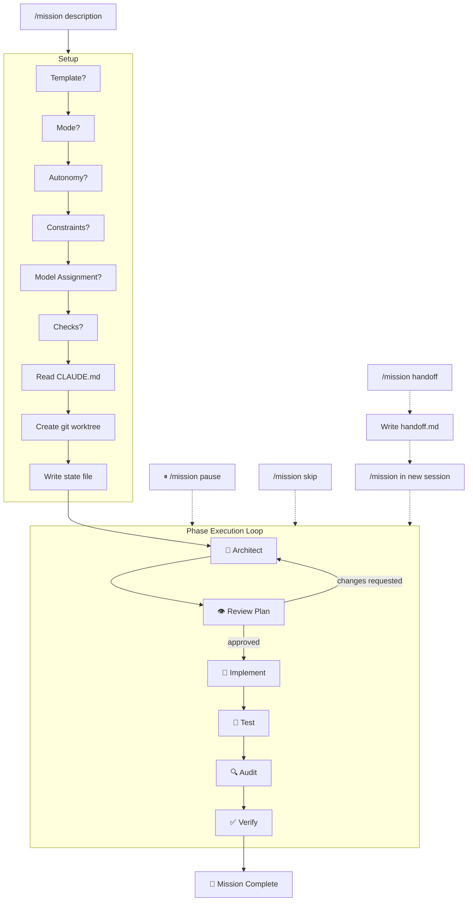
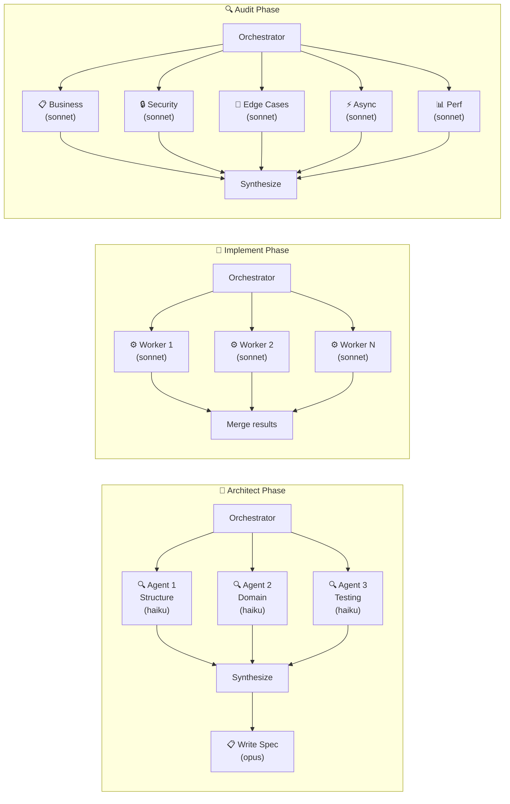
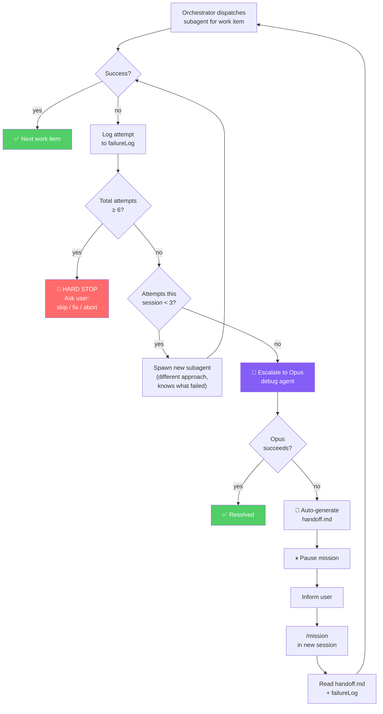
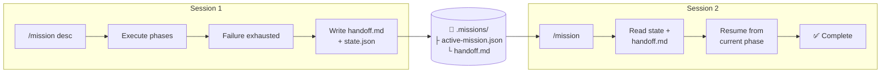

# Architecture

## Mission Lifecycle



## Parallel Subagents



## Failure Escalation & Auto-Handoff



## State & Session Continuity



## Chain of Command

```
User
  └─→ /mission orchestrator (the brain)
        ├─→ Scripts (deterministic — no reasoning)
        │     ├── mission-state.mjs
        │     ├── mission-checks.mjs
        │     └── worktree-manager.mjs
        ├─→ Subagents (reasoning — no decisions)
        │     ├── Explorer agents (haiku)
        │     ├── Worker agents (sonnet)
        │     ├── Reviewer agents (sonnet)
        │     └── Debug agent (planner model)
        └─→ State file (single source of truth)
```

Commands flow downward only. Subagents report results — they never decide to retry, escalate, or hand off. Only the orchestrator writes to the state file.
